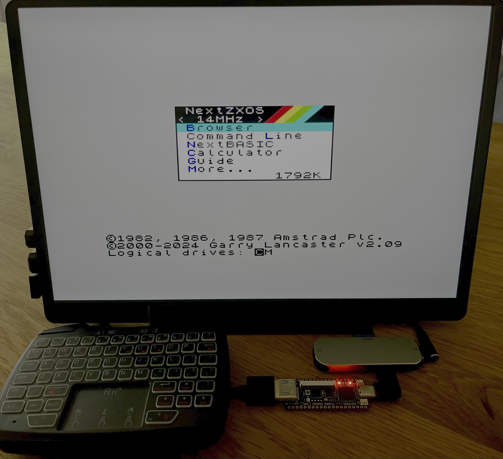
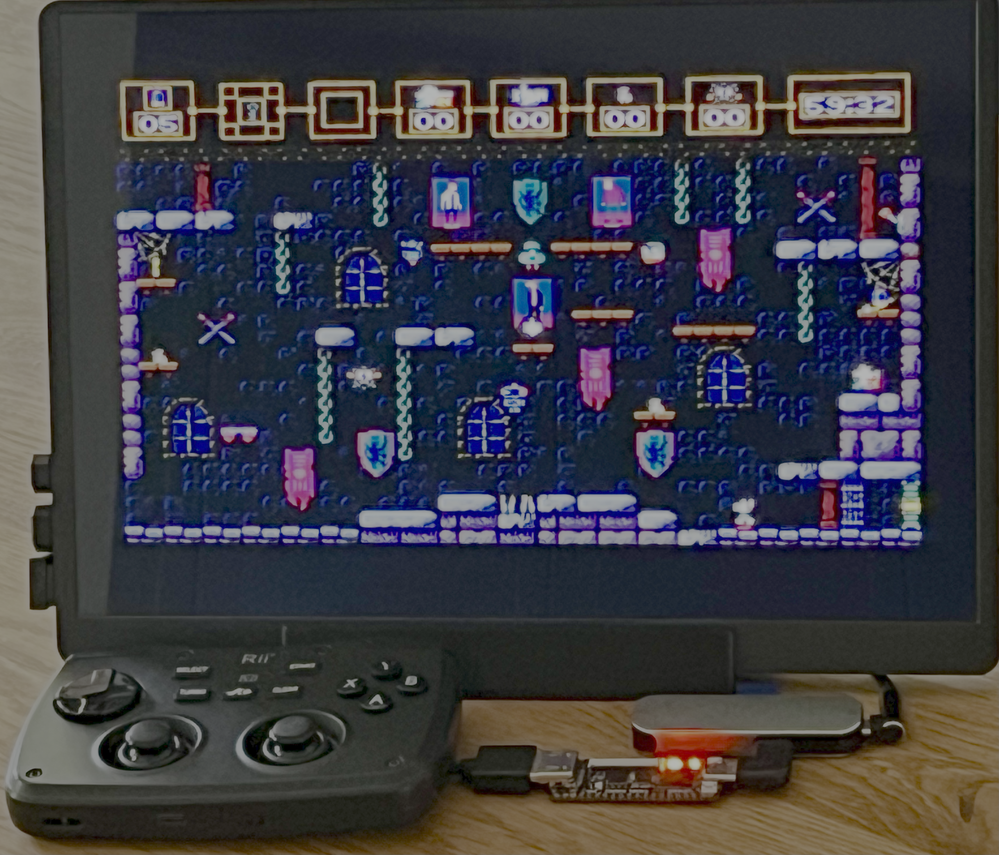

# NextNano - ZX Spectrum Next implementation for the Tang Nano 20K FPGA board.

> **Status:** Early release — actively developed. Source code release planned.

📺 **[Watch The Saboteur! NEXT on NextNano in action on YouTube](https://www.youtube.com/watch?v=FlwklhXbSbg)**




## Hardware Requirements

-   **Tang Nano 20K** (Sipeed, Gowin GW2AR-18)
-   **USB-C Hub** — an active (powered) hub is recommended
-   **USB Keyboard** — wireless or wired
-   **microSD card** (FAT32, with NextZXOS contents — see below)
-   **HDMI display** and cable

### Optional:

-  **USB mouse** (emulated as Kempston Mouse)
-   **USB gamepad or joystick** (emulated as Kempston / Left port, 4 buttons)

## Preparing the SD Card

The SD card is **required** — NextNano boots into NextZXOS from the card.

1.  Format a microSD card as **FAT32**.
2.  Download the latest NextZXOS distribution from: **[https://www.specnext.com/latestdistro/](https://www.specnext.com/latestdistro/)**
3.  Extract the contents of the archive to the root of the SD card.
4.  Insert the card into the Tang Nano 20K's SD slot before powering on.

## Features

### Implemented

-   All ZX Spectrum Next features
-   Joystick (left port, Kempston)
-   Mouse (Kempston)
-   Keyboard
-   HDMI video and audio output

### Notes & Current Limitations

-   The system **boots at 14 MHz**. Switching to **28 MHz via F8 after boot seems stable**.
-   **60 Hz video mode (F3) is not yet supported** — leave the system in the default 50 Hz mode.
-   **Networking is not yet implemented**. Network features will require an external BL616 (**M0S Dock**), because the BL616 built into the Tang Nano 20K has no antenna.

## Software Compatibility

All software tested so far runs flawlessly — including demoscene productions, games, BASIC programs, and utilities.


## Keyboard Mapping

| Spectrum Key   | USB Key             |
|----------------|---------------------|
| Symbol Shift   | Left Ctrl           |
| Edit           | Caps Shift + 1 or ~    |
| Break          | Caps Shift + Space  |
| Cursor keys    | Arrow keys          |

> Example: to type `LOAD ""` at the BASIC prompt, press `J`, then `Symbol Shift + P` twice.

## Function Keys

| Key  | Function                                            |
|------|-----------------------------------------------------|
| F1   | Hard reset                                          |
| F3   | Toggle 50 / 60 Hz video mode (60 Hz not yet supported) |
| F4   | Soft reset                                          |
| F8   | Cycle CPU clock: 3.5 / 7 / 14 / 28 MHz              |
| F9   | NMI / Multiface                                     |
| F10  | DivMMC NMI                                          |


## Installation

### Release v0.1 — First Release

This is the first official release of the project. It includes:

-   **`NextNano.fs`** — the FPGA bitstream, ready to be flashed onto the Tang Nano 20K.
-   **Two variants of the FPGA Companion firmware:**
    -   **`fpga_companion_TN20k_internal.bin`** — for the BL616 microcontroller built into Tang Nano 20K boards.
    -   **`fpga_companion_bl616_m0s_dock.bin`** — for an external M0S Dock.
-   **`bl616_fpga_partner_nano20k.bin`** — BL616 bootloader (required when using the onboard BL616).


### Flashing the FPGA Bitstream

**macOS / Linux** — use [`openFPGALoader`](https://github.com/trabucayre/openFPGALoader):

```bash
openFPGALoader -f NextNano.fs

```

The `-f` flag writes the bitstream to the onboard flash so it persists across power cycles. Without `-f`, the bitstream is loaded into SRAM and will be lost on power-off.

**Windows** — use **Gowin Programmer**, included with the Gowin EDA toolchain. Select the Tang Nano 20K device, set the operation to _Embedded Flash Mode → Erase, Program_, choose `NextNano.fs`, and click _Program_.

### Flashing the FPGA Companion

To upload the FPGA Companion firmware, use the **Bouffalo Dev Cube** software (provided by BouffaloLab - https://dev.bouffalolab.com/download). Select the correct firmware file and load address for your setup:

| Target                        | Firmware File                          | Load Address |
|-------------------------------|----------------------------------------|--------------|
| Onboard BL616 (internal µC)   | `bl616_fpga_partner_nano20k.bin`       | `0x00000`    |
| Onboard BL616 (internal µC)   | `fpga_companion_TN20k_internal.bin`    | `0x40000`    |
| External M0S Dock             | `fpga_companion_bl616_m0s_dock.bin`    | `0x00000`    |


The onboard BL616 setup requires **both** files to be flashed at their respective load addresses.

----------

## Troubleshooting

**Black screen / no boot after power-on** Make sure the SD card is formatted as FAT32 and contains the extracted NextZXOS distribution at the root. The card must be inserted _before_ applying power.

**Monitor reports "No signal"** Some older or unusual HDMI displays may not handle the output mode correctly. Try a different display or HDMI cable. NextNano outputs 50 Hz by default — modern TVs and monitors usually accept this, but some PC monitors do not.

**Bitstream disappears after power-off** You programmed the FPGA in SRAM mode instead of Flash. With `openFPGALoader`, include the `-f` flag. With Gowin Programmer, select _Embedded Flash Mode → Erase, Program_ (not _SRAM Mode_).

**Keyboard, mouse, or joystick not responding** The USB hub likely cannot supply enough current. Use an **active (powered) USB-C hub**. Also confirm that the FPGA Companion firmware has been flashed correctly to the BL616.

**System hangs or behaves erratically after pressing F8** The CPU clock cycles through 3.5 / 7 / 14 / 28 MHz. If a specific program is sensitive to one of these speeds, press F8 again to advance to the next speed, or press F4 (soft reset) to restart at 14 MHz.

**SD card not detected** The card must be formatted as **FAT32**. exFAT and NTFS are not supported. Use a different card or reformat if necessary.

----------

## Acknowledgments

NextNano stands on the shoulders of these projects:

-   **SpecNext Ltd. and the ZX Spectrum Next community**
-   **MiSTer FPGA** (https://github.com/MiSTer-devel/ZXNext_MISTer)
-   **MiSTle-Dev**(https://github.com/MiSTle-Dev/FPGA-Companion)

## Disclaimer

This project is not affiliated with, endorsed by, or associated with the official ZX Spectrum Next project or SpecNext Ltd.

Source code will be released in a future update.
