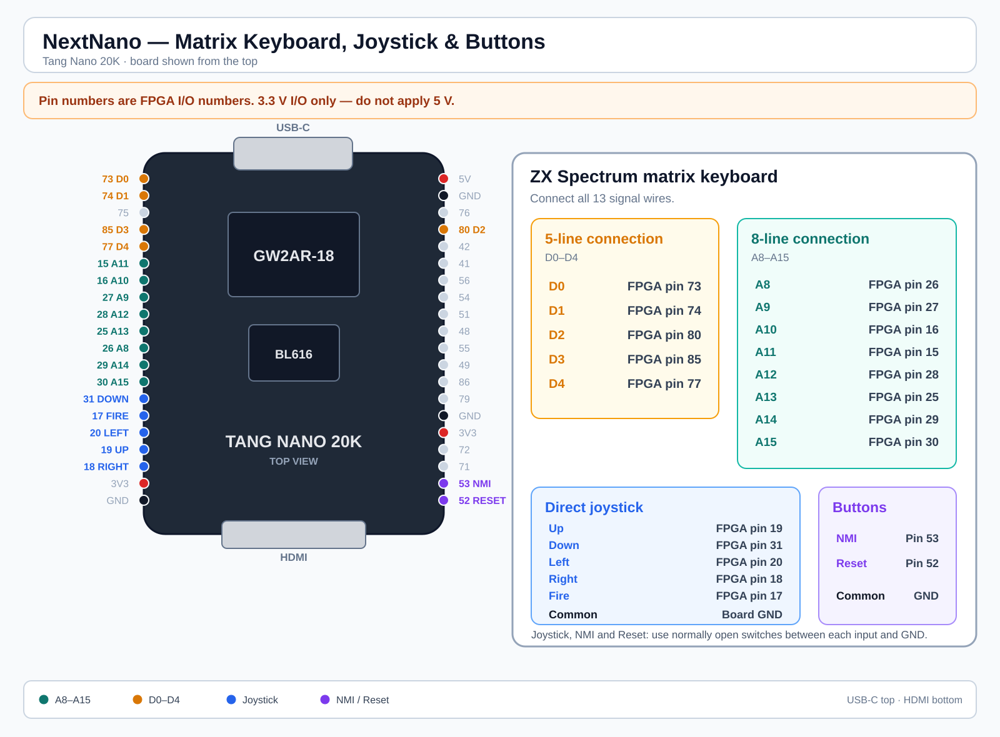

# NextNano — ZX Spectrum Next for the Tang Nano 20K FPGA board

> **Version 1.0 — stable release. Source code available.**

NextNano is a ZX Spectrum Next implementation for the Sipeed Tang Nano 20K (Gowin GW2AR-18) FPGA board.

Version 1.0 brings the project to a stable, fully usable state. CPU speed switching works like on the original ZX Spectrum Next, PAL and NTSC modes are supported, all software tested so far works correctly, and an on-screen keyboard makes controller-only operation practical.

📺 [Watch The Saboteur! NEXT on NextNano in action on YouTube](https://www.youtube.com/watch?v=FlwklhXbSbg)

## Highlights

- Native ZX Spectrum Next CPU speed switching: **3.5 / 7 / 14 / 28 MHz**
  - software can change CPU speed in the same way as on the original ZX Spectrum Next
  - `F8` can also be used to cycle the CPU speed manually
- **PAL (50 Hz)** and **NTSC (60 Hz)** video modes
- HDMI video and audio output
- USB keyboard support
- USB gamepad / joystick support
- USB mouse support, emulated as Kempston Mouse
- On-screen keyboard, opened with a gamepad Y button (may vary between gamepads)
- Soft reset triggered by simultaneously pressing the Left Shoulder and Right Shoulder buttons.
- PAL/NTSC toggle via the Left Shoulder button.
- Verified software compatibility — all games, demos, BASIC programs and utilities tested so far run correctly
- Two bitstream variants are provided:
  - **USB version** — for USB keyboard and controllers
  - **Matrix keyboard version** — adds direct support for a ZX Spectrum matrix keyboard, a wired joystick, NMI and Reset buttons

## Hardware Requirements

### USB version

- Tang Nano 20K (Sipeed, Gowin GW2AR-18)
- USB-C hub — an active (powered) hub is recommended
- USB keyboard — wireless or wired
- microSD card, FAT32, containing NextZXOS
- HDMI display and cable

Optional:

- USB mouse — emulated as Kempston Mouse
- USB gamepad or joystick — emulated as Kempston / left joystick port, with 4 buttons

### Matrix keyboard version

A separate bitstream is provided for systems using a directly connected ZX Spectrum matrix keyboard and joystick.

The keyboard, joystick, NMI and Reset wiring is described in [Matrix keyboard and controls](#matrix-keyboard-and-controls).

## Preparing the SD Card

The SD card is required — NextNano boots into NextZXOS from the card.

1. Format a microSD card as FAT32.
2. Download the latest NextZXOS distribution from: https://www.specnext.com/latestdistro/
3. Extract the contents of the archive to the root of the SD card.
4. Insert the card into the Tang Nano 20K SD slot before powering on.

## CPU Speed

NextNano supports the full ZX Spectrum Next CPU clock range:

- 3.5 MHz
- 7 MHz
- 14 MHz
- 28 MHz

CPU speed can be changed by ZX Spectrum Next software and NextZXOS in the same way as on original Next hardware. For manual testing, `F8` cycles through the available speeds.

## Video Modes

Both major timing modes are supported:

- **PAL / 50 Hz**
- **NTSC / 60 Hz**

`F3` toggles between 50 Hz and 60 Hz output.

## Software Compatibility

All software tested so far runs correctly, including:

- games
- demoscene productions
- BASIC programs
- utilities
- NextZXOS applications
- 128K, 48K, Pentagon software

## On-Screen Keyboard

NextNano includes an on-screen keyboard that can be opened directly with a gamepad Y button (may vary between gamepads).

This makes it possible to operate many games and applications without keeping a physical USB keyboard connected — useful for compact systems, living-room setups and event/demo machines.

## USB Keyboard Mapping

| Spectrum Key | USB Key |
|---|---|
| Symbol Shift | Left Ctrl |
| Edit | Caps Shift + 1 or `~` |
| Break | Caps Shift + Space |
| Cursor keys | Arrow keys |

Example: to type `LOAD ""` at the BASIC prompt, press `J`, then `Symbol Shift + P` twice.

## Function Keys

| Key | Function |
|---|---|
| F1 | Hard reset |
| F3 | Toggle PAL / NTSC (50 / 60 Hz) |
| F4 | Soft reset |
| F8 | Cycle CPU clock: 3.5 / 7 / 14 / 28 MHz |
| F9 | NMI / Multiface |
| F10 | DivMMC NMI |

## Matrix Keyboard and Controls

The matrix-keyboard bitstream allows an original ZX Spectrum keyboard membrane, or a compatible passive matrix keyboard, to be connected directly to the Tang Nano 20K GPIO header.

Pin numbers below are **FPGA I/O pin numbers** as shown on the Tang Nano 20K pinout.

### ZX Spectrum keyboard — 5-line connection

| Keyboard line | FPGA pin |
|---|---:|
| D0 | 73 |
| D1 | 74 |
| D2 | 80 |
| D3 | 85 |
| D4 | 77 |

### ZX Spectrum keyboard — 8-line connection

| Keyboard line | FPGA pin |
|---|---:|
| A8 | 26 |
| A9 | 27 |
| A10 | 16 |
| A11 | 15 |
| A12 | 28 |
| A13 | 25 |
| A14 | 29 |
| A15 | 30 |

Connect all **13 keyboard signal wires**. A passive keyboard membrane needs no separate power connection.

- `A8`–`A15`: row outputs
- `D0`–`D4`: inputs with pull-ups
- a key press connects one `A` line to one `D` line

### Direct joystick

| Control | FPGA pin |
|---|---:|
| Up | 19 |
| Down | 31 |
| Left | 20 |
| Right | 18 |
| Fire | 17 |
| Common | Board GND |

### Direct buttons

| Control | FPGA pin |
|---|---:|
| NMI | 53 |
| Reset | 52 |

Use normally open switches between each joystick/button input and GND.

**FPGA I/O is 3.3 V. Do not apply 5 V.**

### Wiring diagram



## Current Limitation

Networking is not currently implemented. Network functionality requires an external BL616 / M0S Dock because the BL616 built into the Tang Nano 20K has no antenna.

## Building from Source

Use **Gowin EDA 1.9.12.03** and the provided `nextNano.tcl` script.

The build has been tested on Linux using `gw_sh`.

From the source directory:

```bash
gw_sh nextNano.tcl
```

## Flashing the FPGA Bitstream

### macOS / Linux

Use `openFPGALoader`:

```bash
openFPGALoader -f NextNano.fs
```

The `-f` flag writes the bitstream to onboard flash so it survives power cycling. Without `-f`, the bitstream is loaded into SRAM only.

### Windows

Use Gowin Programmer, included with the Gowin EDA toolchain.

Select the Tang Nano 20K device, choose **Embedded Flash Mode → Erase, Program**, select `NextNano.fs`, and click **Program**.

## Flashing the FPGA Companion

Use Bouffalo Dev Cube to upload the FPGA Companion firmware.

| Target | Firmware file | Load address |
|---|---|---:|
| Onboard BL616 | `bl616_fpga_partner_nano20k.bin` | `0x00000` |
| Onboard BL616 | `fpga_companion_TN20k_internal.bin` | `0x40000` |
| External M0S Dock | `fpga_companion_bl616_m0s_dock.bin` | `0x00000` |

The onboard BL616 setup requires both internal-BL616 files to be flashed at their respective load addresses.

## Acknowledgments

NextNano stands on the shoulders of these projects and communities:

- SpecNext Ltd. and the ZX Spectrum Next community
- MiSTer FPGA — https://github.com/MiSTer-devel/ZXNext_MISTer
- MiSTle-Dev FPGA Companion — https://github.com/MiSTle-Dev/FPGA-Companion

## Disclaimer

This project is not affiliated with, endorsed by, or associated with the official ZX Spectrum Next project or SpecNext Ltd.
